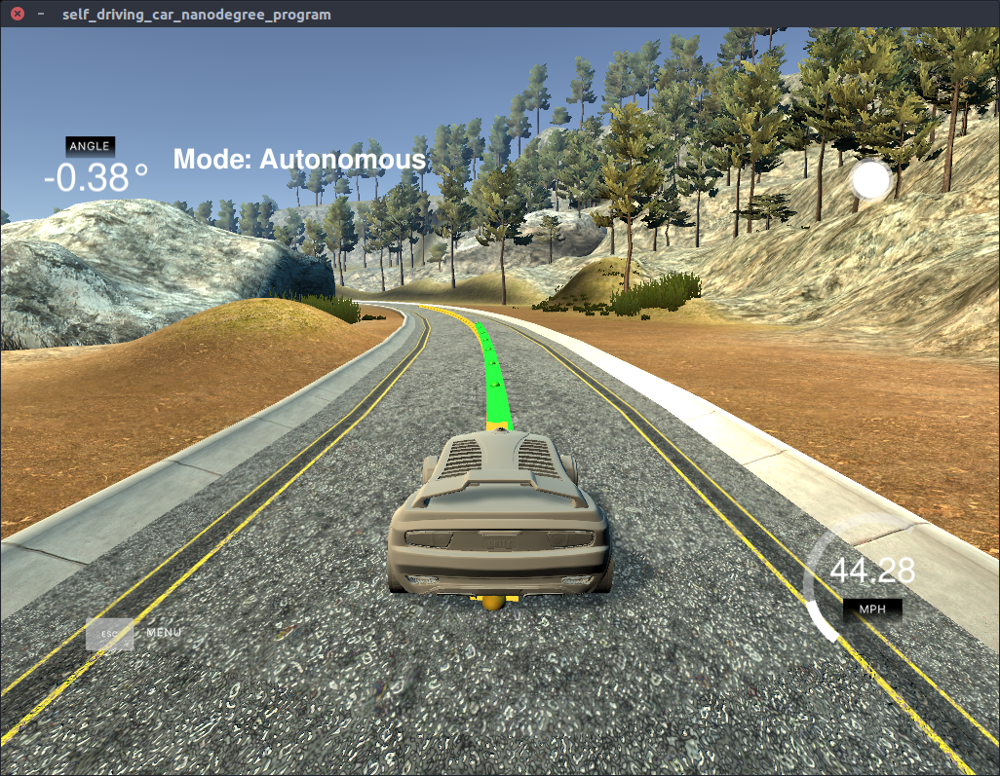

This code utilize a Model Predictive Controller (MPC) to steer and regulate the velocity of a vehicle about a give path trajectory. A video of the filter in action can be seen below.

 [](https://youtu.be/t5-I2tkAX5E)

## Writeup

The [writeup.md](writeup.md) contains details of the code and mathematicle derivations used in this project.

---

## Prerequisites

* cmake >= 3.5
 * All OSes: [click here for installation instructions](https://cmake.org/install/)
* make >= 4.1
  * Linux: make is installed by default on most Linux distros
  * Mac: [install Xcode command line tools to get make](https://developer.apple.com/xcode/features/)
* gcc/g++ >= 5.4
  * Linux: gcc / g++ is installed by default on most Linux distros
  * Mac: same deal as make - [install Xcode command line tools]((https://developer.apple.com/xcode/features/)
  * [uWebSockets](https://github.com/uWebSockets/uWebSockets)
    * Run either `install-mac.sh` or `install-ubuntu.sh`.
    * If you install from source, checkout to commit `e94b6e1`, i.e.
      ```
      git clone https://github.com/uWebSockets/uWebSockets
      cd uWebSockets
      git checkout e94b6e1
      ```
      Some function signatures have changed in v0.14.x. See [this PR](https://github.com/udacity/CarND-MPC-Project/pull/3) for more details.
  * Fortran Compiler
    * Mac: `brew install gcc` (might not be required)
    * Linux: `sudo apt-get install gfortran`. Additionall you have also have to install gcc and g++, `sudo apt-get install gcc g++`.
  * [Ipopt](https://projects.coin-or.org/Ipopt)
    * Mac: `brew install ipopt`
    * Linux
      * You will need a version of Ipopt 3.12.1 or higher. The version available through `apt-get` is 3.11.x. You just need to download the source from the Ipopt [releases page](https://www.coin-or.org/download/source/Ipopt/) or the [Github releases](https://github.com/coin-or/Ipopt/releases) page.
      * Then call `install_ipopt.sh` with the source directory as the first argument, ex: `sudo bash install_ipopt.sh Ipopt-3.12.1`.
  * [CppAD](https://www.coin-or.org/CppAD/)
    * Mac: `brew install cppad`
    * Linux `sudo apt-get install cppad` or equivalent.

## Simulator

This project involves the Udacity Term 2 Simulator which can be downloaded [here](https://github.com/udacity/self-driving-car-sim/releases/tag/v1.0)

## Basic Build Instructions

1. Clone this repo.

```sh
$ git clone https://github.com/Heych88/udacity-sdcnd-MPC-Project.git
```

2. This repository includes two files that can be used to set up and intall [uWebSocketIO](https://github.com/uWebSockets/uWebSockets) for either Linux or Mac systems. For windows you can use either Docker, VMware, or even [Windows 10 Bash on Ubuntu](https://www.howtogeek.com/249966/how-to-install-and-use-the-linux-bash-shell-on-windows-10/) to install uWebSocketIO.

Install [uWebSocketIO](https://github.com/uWebSockets/uWebSockets) by running the script

For Linux
`
bash install-ubuntu.sh
`

For Mac
`
sh install-mac.sh
`

If the above fails, install intall [uWebSocketIO](https://github.com/uWebSockets/uWebSockets) seperatly, then build and ran by doing the following from the project top directory.

1. mkdir build
2. cd build
3. cmake ..
4. make

## Running in the Simulator

The following assumes the **Basic Build Instructions** was followed and produced no errors.

Download and extract the [simulator](https://github.com/udacity/self-driving-car-sim/releases/tag/v1.0).

1. Navigate to the extrated simulator directory and run the simulator.
2. Select the settings best for your computer and click **ok**.
3. In a terminal window run the MPC executable
```
./mpc
```

The car will now drive around the track and you should arrive at a result similar to the below.




## Contributing

1. Fork it!
2. Create your feature branch: `git checkout -b my-new-feature`
3. Commit your changes: `git commit -am 'Add some feature'`
4. Push to the branch: `git push origin my-new-feature`
5. Submit a pull request.

## License

This project is licensed under the MIT License - see the [LICENSE.md](LICENSE.md) file for details.
